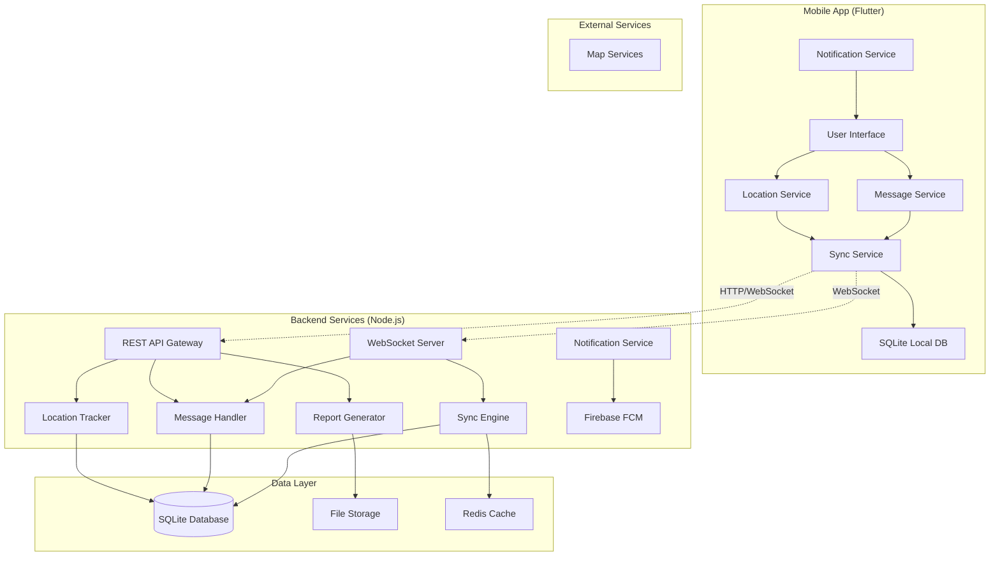
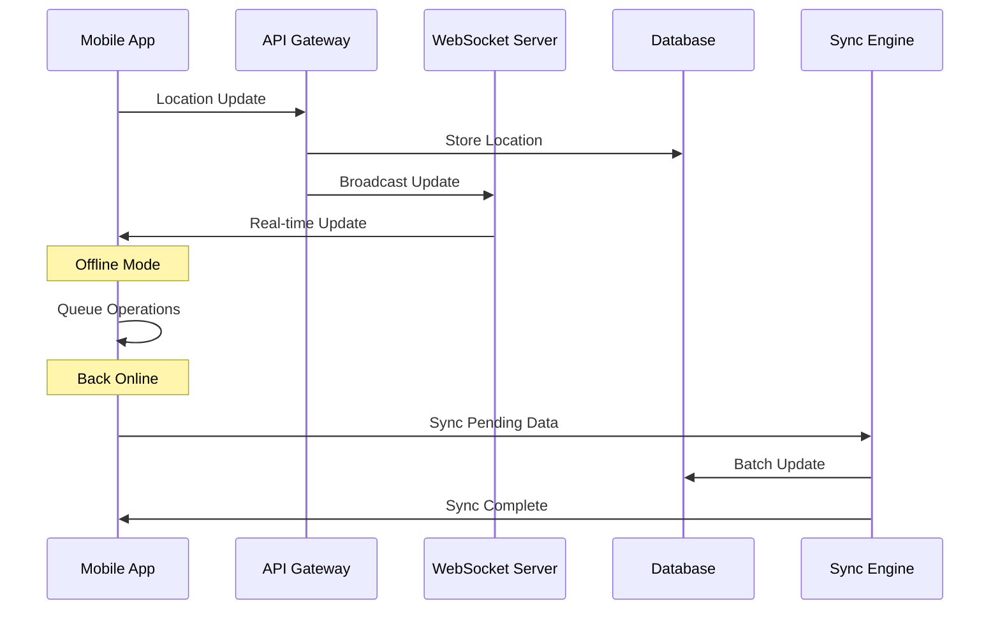

# Design Document - GPS RAPOR System Redesign

## Overview

The GPS RAPOR system redesign implements a modern, resilient architecture for real-time location tracking and personnel management. The system addresses critical issues in the existing implementation through an offline-first approach, robust synchronization mechanisms, and comprehensive error handling. The architecture leverages proven patterns including event-driven design, CQRS for data operations, and microservices principles while maintaining deployment simplicity on the existing Raspberry Pi infrastructure.

Key architectural decisions include:
- **Offline-First Design**: All operations work offline with automatic synchronization
- **Event-Driven Architecture**: Decoupled components communicating via events
- **Dual-Service Location Tracking**: Foreground and background services for continuous tracking
- **Message Queue System**: Reliable message delivery with retry mechanisms
- **Connection Pooling**: Optimized database performance for concurrent operations
- **Real-Time Synchronization**: WebSocket-based real-time updates with fallback mechanisms

## Architecture

### System Architecture Diagram



### Component Interaction Flow



## Components and Interfaces

### Mobile Application Components

#### Location Service
**Purpose**: Continuous location tracking with foreground and background services

**Key Features**:
- Dual-service architecture (foreground + background)
- Battery optimization with adaptive update intervals
- GPS and network-based location fallback
- Offline location storage with automatic sync

**Interface**:
```dart
abstract class LocationService {
  Stream<LocationData> get locationStream;
  Future<void> startTracking();
  Future<void> stopTracking();
  Future<void> enableBackgroundTracking();
  Future<List<LocationData>> getPendingLocations();
}

class LocationData {
  final double latitude;
  final double longitude;
  final double accuracy;
  final DateTime timestamp;
  final double batteryLevel;
  final String source; // 'gps' | 'network' | 'passive'
}
```

**Implementation Strategy**:
- Uses `flutter_background_geolocation` for reliable background tracking
- Implements adaptive update intervals based on movement and battery level
- Stores locations locally using SQLite with automatic cleanup
- Handles permission requests and provides fallback options

#### Message Service
**Purpose**: Real-time messaging with offline support and message queuing

**Key Features**:
- Real-time message delivery via WebSocket
- Offline message composition and queuing
- Message history with full-text search
- Support for text, location, and image attachments

**Interface**:
```dart
abstract class MessageService {
  Stream<Message> get messageStream;
  Future<void> sendMessage(Message message);
  Future<List<Message>> getMessageHistory(String conversationId);
  Future<List<Message>> searchMessages(String query);
  Future<void> markAsRead(String messageId);
}

class Message {
  final String id;
  final String senderId;
  final String content;
  final MessageType type;
  final DateTime timestamp;
  final MessageStatus status;
  final Map<String, dynamic>? metadata;
}
```

#### Sync Service
**Purpose**: Data synchronization with conflict resolution and offline support

**Key Features**:
- Incremental synchronization with delta updates
- Conflict resolution using timestamp-based last-writer-wins
- Automatic retry with exponential backoff
- Bandwidth optimization with compression

**Interface**:
```dart
abstract class SyncService {
  Stream<SyncStatus> get syncStatusStream;
  Future<void> syncAll();
  Future<void> syncLocations();
  Future<void> syncMessages();
  Future<void> resolveConflicts(List<Conflict> conflicts);
}

class SyncStatus {
  final bool isOnline;
  final bool isSyncing;
  final int pendingOperations;
  final DateTime? lastSyncTime;
  final List<SyncError> errors;
}
```

### Backend Components

#### API Gateway
**Purpose**: Central entry point for all HTTP requests with authentication and rate limiting

**Key Features**:
- JWT-based authentication with automatic token refresh
- Rate limiting per user and endpoint
- Request/response logging and monitoring
- API versioning support

**Interface**:
```javascript
class APIGateway {
  // Authentication endpoints
  POST /api/v1/auth/login
  POST /api/v1/auth/refresh
  POST /api/v1/auth/logout
  
  // Location endpoints
  POST /api/v1/locations
  GET /api/v1/locations/:userId
  GET /api/v1/locations/history
  
  // Message endpoints
  POST /api/v1/messages
  GET /api/v1/messages/:conversationId
  PUT /api/v1/messages/:messageId/read
  
  // Report endpoints
  POST /api/v1/reports/generate
  GET /api/v1/reports/:reportId
  GET /api/v1/reports/download/:reportId
}
```

#### WebSocket Server
**Purpose**: Real-time bidirectional communication with automatic reconnection

**Key Features**:
- Socket.IO for reliable WebSocket communication
- Automatic reconnection with exponential backoff
- Room-based message broadcasting
- Heartbeat mechanism for connection monitoring

**Interface**:
```javascript
class WebSocketServer {
  // Connection events
  on('connection', (socket) => {})
  on('disconnect', (socket) => {})
  
  // Location events
  on('location:update', (data) => {})
  on('location:subscribe', (userId) => {})
  
  // Message events
  on('message:send', (message) => {})
  on('message:typing', (data) => {})
  
  // Sync events
  on('sync:request', (data) => {})
  on('sync:complete', (result) => {})
}
```

#### Location Tracker
**Purpose**: Server-side location processing and storage with real-time updates

**Key Features**:
- Batch location processing for performance
- Geofencing and route analysis
- Location history compression
- Real-time location broadcasting

**Interface**:
```javascript
class LocationTracker {
  async processLocationUpdate(userId, locationData)
  async getLocationHistory(userId, timeRange)
  async analyzeRoute(userId, startTime, endTime)
  async checkGeofences(userId, location)
  async compressLocationHistory(userId, olderThan)
}
```

#### Message Handler
**Purpose**: Message processing, storage, and delivery with offline support

**Key Features**:
- Message queuing for offline users
- Message delivery confirmation
- File attachment handling
- Message search indexing

**Interface**:
```javascript
class MessageHandler {
  async sendMessage(message)
  async deliverPendingMessages(userId)
  async storeMessage(message)
  async searchMessages(query, userId)
  async handleAttachment(file, messageId)
}
```

#### Report Generator
**Purpose**: PDF report generation with maps and analytics

**Key Features**:
- Automated daily and weekly reports
- Interactive map generation with routes
- Performance analytics and statistics
- Report scheduling and distribution

**Interface**:
```javascript
class ReportGenerator {
  async generateDailyReport(date, userIds)
  async generateWeeklyReport(weekStart, userIds)
  async generateCustomReport(criteria)
  async scheduleReport(schedule, criteria)
  async distributeReport(reportId, recipients)
}
```

## Data Models

### Core Data Structures

#### User Model
```javascript
const UserSchema = {
  id: String, // Primary key
  personnelId: String, // Personnel number (01-42)
  name: String,
  email: String,
  phone: String,
  role: String, // 'personnel' | 'admin'
  isActive: Boolean,
  lastSeen: Date,
  deviceInfo: {
    deviceId: String,
    platform: String,
    appVersion: String,
    fcmToken: String
  },
  preferences: {
    notifications: Object,
    locationUpdateInterval: Number,
    theme: String
  },
  createdAt: Date,
  updatedAt: Date
}
```

#### Location Model
```javascript
const LocationSchema = {
  id: String,
  userId: String,
  latitude: Number,
  longitude: Number,
  accuracy: Number,
  altitude: Number,
  speed: Number,
  heading: Number,
  timestamp: Date,
  batteryLevel: Number,
  source: String, // 'gps' | 'network' | 'passive'
  isManual: Boolean,
  metadata: {
    address: String,
    activity: String, // 'still' | 'walking' | 'driving'
    confidence: Number
  },
  syncStatus: String, // 'pending' | 'synced' | 'failed'
  createdAt: Date
}
```

#### Message Model
```javascript
const MessageSchema = {
  id: String,
  conversationId: String,
  senderId: String,
  recipientIds: [String],
  content: String,
  type: String, // 'text' | 'location' | 'image' | 'system'
  status: String, // 'pending' | 'sent' | 'delivered' | 'read'
  timestamp: Date,
  editedAt: Date,
  attachments: [{
    id: String,
    type: String,
    url: String,
    size: Number,
    metadata: Object
  }],
  location: {
    latitude: Number,
    longitude: Number,
    address: String
  },
  syncStatus: String,
  createdAt: Date
}
```

#### Report Model
```javascript
const ReportSchema = {
  id: String,
  type: String, // 'daily' | 'weekly' | 'custom'
  title: String,
  description: String,
  criteria: {
    userIds: [String],
    startDate: Date,
    endDate: Date,
    includeLocations: Boolean,
    includeMessages: Boolean,
    includeAnalytics: Boolean
  },
  status: String, // 'generating' | 'completed' | 'failed'
  fileUrl: String,
  fileSize: Number,
  generatedBy: String,
  generatedAt: Date,
  expiresAt: Date,
  downloadCount: Number,
  createdAt: Date
}
```

### Database Schema Design

#### SQLite Schema (Mobile)
```sql
-- Users table
CREATE TABLE users (
  id TEXT PRIMARY KEY,
  personnel_id TEXT UNIQUE,
  name TEXT NOT NULL,
  email TEXT,
  role TEXT DEFAULT 'personnel',
  is_active BOOLEAN DEFAULT 1,
  last_sync DATETIME,
  created_at DATETIME DEFAULT CURRENT_TIMESTAMP
);

-- Locations table with indexing for performance
CREATE TABLE locations (
  id TEXT PRIMARY KEY,
  user_id TEXT REFERENCES users(id),
  latitude REAL NOT NULL,
  longitude REAL NOT NULL,
  accuracy REAL,
  timestamp DATETIME NOT NULL,
  battery_level REAL,
  source TEXT DEFAULT 'gps',
  sync_status TEXT DEFAULT 'pending',
  created_at DATETIME DEFAULT CURRENT_TIMESTAMP
);

CREATE INDEX idx_locations_user_timestamp ON locations(user_id, timestamp);
CREATE INDEX idx_locations_sync_status ON locations(sync_status);

-- Messages table
CREATE TABLE messages (
  id TEXT PRIMARY KEY,
  conversation_id TEXT,
  sender_id TEXT,
  content TEXT,
  type TEXT DEFAULT 'text',
  status TEXT DEFAULT 'pending',
  timestamp DATETIME NOT NULL,
  sync_status TEXT DEFAULT 'pending',
  created_at DATETIME DEFAULT CURRENT_TIMESTAMP
);

CREATE INDEX idx_messages_conversation ON messages(conversation_id, timestamp);
CREATE INDEX idx_messages_sync_status ON messages(sync_status);

-- Sync operations table
CREATE TABLE sync_operations (
  id TEXT PRIMARY KEY,
  operation_type TEXT NOT NULL,
  table_name TEXT NOT NULL,
  record_id TEXT NOT NULL,
  operation TEXT NOT NULL, -- 'insert' | 'update' | 'delete'
  data TEXT, -- JSON data
  status TEXT DEFAULT 'pending',
  retry_count INTEGER DEFAULT 0,
  created_at DATETIME DEFAULT CURRENT_TIMESTAMP
);
```

#### Server Database Schema (SQLite with optimizations)
```sql
-- Enhanced server schema with performance optimizations
CREATE TABLE users (
  id TEXT PRIMARY KEY,
  personnel_id TEXT UNIQUE NOT NULL,
  name TEXT NOT NULL,
  email TEXT UNIQUE,
  phone TEXT,
  role TEXT DEFAULT 'personnel',
  password_hash TEXT,
  is_active BOOLEAN DEFAULT 1,
  last_seen DATETIME,
  device_info TEXT, -- JSON
  preferences TEXT, -- JSON
  created_at DATETIME DEFAULT CURRENT_TIMESTAMP,
  updated_at DATETIME DEFAULT CURRENT_TIMESTAMP
);

-- Partitioned locations table for better performance
CREATE TABLE locations (
  id TEXT PRIMARY KEY,
  user_id TEXT REFERENCES users(id),
  latitude REAL NOT NULL,
  longitude REAL NOT NULL,
  accuracy REAL,
  altitude REAL,
  speed REAL,
  heading REAL,
  timestamp DATETIME NOT NULL,
  battery_level REAL,
  source TEXT DEFAULT 'gps',
  is_manual BOOLEAN DEFAULT 0,
  metadata TEXT, -- JSON
  created_at DATETIME DEFAULT CURRENT_TIMESTAMP
);

-- Optimized indexes for location queries
CREATE INDEX idx_locations_user_time ON locations(user_id, timestamp DESC);
CREATE INDEX idx_locations_timestamp ON locations(timestamp);
CREATE INDEX idx_locations_spatial ON locations(latitude, longitude);

-- Messages with full-text search support
CREATE TABLE messages (
  id TEXT PRIMARY KEY,
  conversation_id TEXT NOT NULL,
  sender_id TEXT REFERENCES users(id),
  recipient_ids TEXT, -- JSON array
  content TEXT,
  type TEXT DEFAULT 'text',
  status TEXT DEFAULT 'sent',
  timestamp DATETIME NOT NULL,
  edited_at DATETIME,
  attachments TEXT, -- JSON
  location_data TEXT, -- JSON
  created_at DATETIME DEFAULT CURRENT_TIMESTAMP
);

CREATE INDEX idx_messages_conversation ON messages(conversation_id, timestamp DESC);
CREATE INDEX idx_messages_sender ON messages(sender_id, timestamp DESC);

-- Full-text search for messages
CREATE VIRTUAL TABLE messages_fts USING fts5(
  content,
  content='messages',
  content_rowid='rowid'
);

-- Reports table
CREATE TABLE reports (
  id TEXT PRIMARY KEY,
  type TEXT NOT NULL,
  title TEXT NOT NULL,
  description TEXT,
  criteria TEXT, -- JSON
  status TEXT DEFAULT 'generating',
  file_url TEXT,
  file_size INTEGER,
  generated_by TEXT REFERENCES users(id),
  generated_at DATETIME,
  expires_at DATETIME,
  download_count INTEGER DEFAULT 0,
  created_at DATETIME DEFAULT CURRENT_TIMESTAMP
);

-- Connection pooling configuration
PRAGMA journal_mode = WAL;
PRAGMA synchronous = NORMAL;
PRAGMA cache_size = 10000;
PRAGMA temp_store = MEMORY;
```

## Correctness Properties

*A property is a characteristic or behavior that should hold true across all valid executions of a system—essentially, a formal statement about what the system should do. Properties serve as the bridge between human-readable specifications and machine-verifiable correctness guarantees.*

Before defining the correctness properties, I need to analyze the acceptance criteria from the requirements document to determine which ones are testable as properties.

### Correctness Properties

Based on the prework analysis, I've identified the testable acceptance criteria and consolidated them into comprehensive properties that eliminate redundancy while ensuring complete coverage.

#### Property 1: Location Tracking Continuity
*For any* personnel device, location tracking should continue uninterrupted across all app states (foreground, background, offline) with appropriate service management and data persistence.
**Validates: Requirements 1.1, 1.3, 1.4**

#### Property 2: Location Data Completeness and Fallback
*For any* location update, the system should store complete metadata (timestamp, accuracy, battery level, source) and automatically fallback to network-based location when GPS is unavailable.
**Validates: Requirements 1.5, 1.6**

#### Property 3: Offline-Online Location Synchronization
*For any* offline period, all location data collected offline should be automatically synchronized when connectivity returns, maintaining data integrity and chronological order.
**Validates: Requirements 1.2, 1.7**

#### Property 4: Message Delivery and Queuing
*For any* message sent, the system should deliver it within timing constraints when online, queue it when offline, and ensure delivery upon reconnection with proper retry mechanisms.
**Validates: Requirements 2.1, 2.2, 2.5**

#### Property 5: Message Synchronization and Notification
*For any* offline period, all missed messages should be synchronized upon reconnection and delivered via push notifications to offline users when they come online.
**Validates: Requirements 2.3, 2.7**

#### Property 6: Message Format and History Support
*For any* supported message type (text, location, image up to 10MB), the system should handle it correctly and maintain searchable history for the required retention period.
**Validates: Requirements 2.4, 2.6**

#### Property 7: Report Generation Completeness
*For any* report type (daily, weekly), the generated PDF should include all required data elements (location history, message logs, analytics, embedded maps) with proper formatting.
**Validates: Requirements 3.1, 3.2, 3.3**

#### Property 8: Report Processing and Backup
*For any* report generation request, the system should complete processing within timing constraints, handle failures with retries, and automatically backup results with proper compression and expiration.
**Validates: Requirements 3.4, 3.5, 3.6, 3.7**

#### Property 9: Notification Delivery and Categorization
*For any* notification event, the system should deliver it via appropriate channels (FCM, in-app, system) based on app state and user preferences, with SMS fallback for critical alerts.
**Validates: Requirements 4.1, 4.2, 4.3, 4.4, 4.5, 4.6, 4.7**

#### Property 10: Data Synchronization and Conflict Resolution
*For any* concurrent data modification, the sync engine should resolve conflicts using timestamp precedence, maintain transaction integrity, and complete synchronization within timing constraints.
**Validates: Requirements 5.1, 5.2, 5.3, 5.4**

#### Property 11: Sync Optimization and Escalation
*For any* sync operation, the system should use compression and incremental updates to minimize bandwidth, and escalate to manual intervention after repeated failures.
**Validates: Requirements 5.5, 5.6, 5.7**

#### Property 12: User Interface Responsiveness
*For any* user interaction or data loading operation, the system should provide immediate feedback within timing constraints and support cancellation of long-running operations.
**Validates: Requirements 6.2, 6.7**

#### Property 13: UI Adaptability and Theme Support
*For any* device configuration or system theme setting, the interface should adapt automatically while maintaining smooth transitions and preserving user context.
**Validates: Requirements 6.3, 6.4, 6.5**

#### Property 14: System Performance and Resource Management
*For any* system operation, response times should meet constraints for local operations, with proper connection pooling, caching, and resource prioritization under constraints.
**Validates: Requirements 7.1, 7.2, 7.3, 7.4, 7.7**

#### Property 15: System Monitoring and Health Checks
*For any* system event, appropriate logging should occur with health checks for critical components and automated alerting when thresholds are exceeded.
**Validates: Requirements 7.5, 7.6**

#### Property 16: Authentication and Encryption
*For any* user session or data transmission, the system should use secure JWT authentication with automatic refresh and encrypt all communications and stored sensitive data.
**Validates: Requirements 8.1, 8.2, 8.3, 8.4**

#### Property 17: Access Control and Security Monitoring
*For any* user action or suspicious activity, the system should enforce role-based permissions and log security events with administrator alerts.
**Validates: Requirements 8.5, 8.6**

#### Property 18: Offline Functionality and Data Management
*For any* offline period, the system should continue essential operations, queue pending actions, and manage local storage with prioritization when space is constrained.
**Validates: Requirements 9.1, 9.2, 9.3, 9.5, 9.6, 9.7**

#### Property 19: Administrative Operations and Maintenance
*For any* administrative function, the system should provide comprehensive dashboard access, detailed error reporting, remote configuration updates, and graceful maintenance procedures.
**Validates: Requirements 10.1, 10.2, 10.3, 10.4**

#### Property 20: Data Export and System Scaling
*For any* data export request or capacity threshold, the system should provide complete data export functionality and alert administrators with scaling suggestions when limits are approached.
**Validates: Requirements 10.5, 10.6, 10.7**

## Error Handling

### Error Classification and Response Strategy

The system implements a comprehensive error handling strategy with categorized responses:

#### Critical Errors (System-Level)
- **Database Connection Failures**: Automatic retry with exponential backoff, fallback to read-only mode
- **Authentication Service Outages**: Local token validation, graceful degradation to cached permissions
- **Location Service Failures**: Automatic service restart, fallback to network location, user notification

#### Recoverable Errors (Operation-Level)
- **Network Connectivity Issues**: Automatic retry with queue management, offline mode activation
- **Message Delivery Failures**: Exponential backoff retry (max 5 attempts), persistent queue storage
- **Report Generation Failures**: Retry mechanism (max 3 attempts), administrator notification

#### User Errors (Input-Level)
- **Invalid Location Data**: Data validation with user feedback, graceful rejection
- **Malformed Messages**: Content sanitization, format correction suggestions
- **Authentication Failures**: Clear error messages, account lockout protection

### Error Recovery Mechanisms

#### Automatic Recovery
```javascript
class ErrorRecoveryManager {
  async handleDatabaseError(error) {
    if (error.type === 'CONNECTION_LOST') {
      await this.retryWithBackoff(this.reconnectDatabase, 5);
      if (!this.isConnected()) {
        await this.activateReadOnlyMode();
      }
    }
  }
  
  async handleNetworkError(operation) {
    await this.queueOperation(operation);
    this.activateOfflineMode();
    this.scheduleRetry(operation, this.calculateBackoff());
  }
}
```

#### Circuit Breaker Pattern
```javascript
class CircuitBreaker {
  constructor(threshold = 5, timeout = 60000) {
    this.failureThreshold = threshold;
    this.timeout = timeout;
    this.state = 'CLOSED'; // CLOSED, OPEN, HALF_OPEN
  }
  
  async execute(operation) {
    if (this.state === 'OPEN') {
      throw new Error('Circuit breaker is OPEN');
    }
    
    try {
      const result = await operation();
      this.onSuccess();
      return result;
    } catch (error) {
      this.onFailure();
      throw error;
    }
  }
}
```

### Error Logging and Monitoring

#### Structured Error Logging
```javascript
class ErrorLogger {
  logError(error, context) {
    const errorEntry = {
      timestamp: new Date().toISOString(),
      level: this.determineLevel(error),
      message: error.message,
      stack: error.stack,
      context: {
        userId: context.userId,
        operation: context.operation,
        deviceInfo: context.deviceInfo
      },
      metadata: {
        version: process.env.APP_VERSION,
        environment: process.env.NODE_ENV
      }
    };
    
    this.writeToLog(errorEntry);
    this.sendToMonitoring(errorEntry);
  }
}
```

## Testing Strategy

### Dual Testing Approach

The GPS RAPOR system requires both unit testing and property-based testing to ensure comprehensive coverage:

#### Unit Testing Focus
- **Specific Examples**: Test concrete scenarios like "user sends message while offline"
- **Edge Cases**: Test boundary conditions like maximum file sizes, empty inputs
- **Integration Points**: Test component interactions and API contracts
- **Error Conditions**: Test specific error scenarios and recovery mechanisms

#### Property-Based Testing Focus
- **Universal Properties**: Test behaviors that should hold for all inputs
- **Comprehensive Input Coverage**: Generate random test data to find edge cases
- **Correctness Verification**: Validate the 20 correctness properties defined above
- **Randomized Scenarios**: Test system behavior across varied conditions

### Property-Based Testing Configuration

**Testing Library**: Use `fast-check` for JavaScript/Node.js backend and `flutter_test` with custom property generators for Flutter frontend.

**Test Configuration**:
- Minimum 100 iterations per property test
- Timeout: 30 seconds per property test
- Shrinking enabled for minimal failing examples
- Seed-based reproducible test runs

**Property Test Structure**:
```javascript
// Example property test for message delivery
describe('Property 4: Message Delivery and Queuing', () => {
  it('should deliver messages within constraints when online, queue when offline', 
    async () => {
      await fc.assert(fc.asyncProperty(
        fc.record({
          message: messageGenerator(),
          networkState: fc.oneof(fc.constant('online'), fc.constant('offline')),
          deviceState: deviceStateGenerator()
        }),
        async ({ message, networkState, deviceState }) => {
          // Test implementation
          const result = await messageService.sendMessage(message, {
            network: networkState,
            device: deviceState
          });
          
          if (networkState === 'online') {
            expect(result.deliveryTime).toBeLessThan(5000);
            expect(result.status).toBe('delivered');
          } else {
            expect(result.status).toBe('queued');
            expect(await messageService.getQueuedMessages()).toContain(message);
          }
        }
      ), { numRuns: 100 });
    }
  );
});
```

**Tag Format for Property Tests**:
Each property test must include a comment tag:
```javascript
// Feature: gps-rapor-redesign, Property 4: Message Delivery and Queuing
```

### Testing Infrastructure

#### Test Environment Setup
- **Isolated Test Database**: Separate SQLite database for each test suite
- **Mock External Services**: Mock FCM, map services, and external APIs
- **Network Simulation**: Simulate various network conditions and failures
- **Device State Simulation**: Mock different device states and capabilities

#### Continuous Integration
- **Automated Test Execution**: Run all tests on every commit
- **Property Test Reporting**: Generate detailed reports for property test failures
- **Performance Benchmarking**: Track performance metrics across test runs
- **Coverage Analysis**: Ensure comprehensive code coverage including error paths

#### Test Data Management
- **Synthetic Data Generation**: Generate realistic test data for all entities
- **Data Anonymization**: Use anonymized production-like data for integration tests
- **Test Data Cleanup**: Automatic cleanup of test data after test execution
- **Reproducible Test Scenarios**: Seed-based generation for consistent test results

This comprehensive testing strategy ensures that the GPS RAPOR system meets all requirements while maintaining high reliability and performance standards.